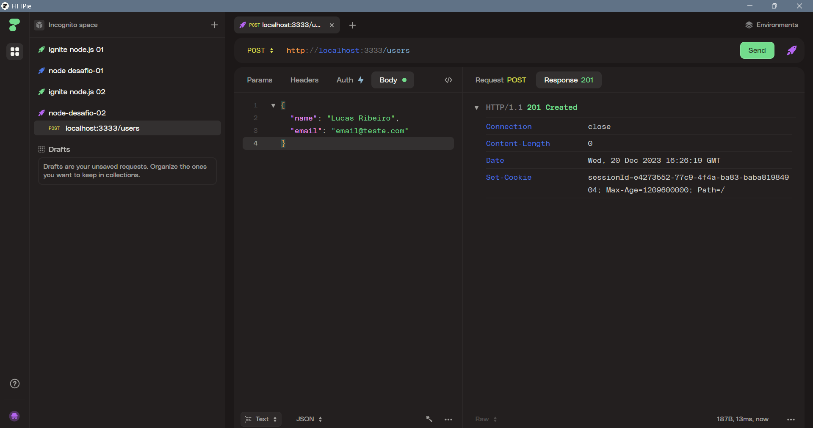

# Daily Diet API

Esta é a API Daily Diet, um sistema de controle de dieta diária.



## Regras da Aplicação

A API possui as seguintes regras e funcionalidades:

- **Criação de Usuário**: É possível criar um usuário.
- **Identificação de Usuário**: O usuário é identificado entre as requisições por meio do session_id.
- **Registro de Refeição**: É possível registrar uma refeição com as seguintes informações:
  - Nome
  - Descrição
  - Data e Hora
  - Está dentro ou fora da dieta
  - As refeições são relacionadas ao usuário que as criou.
- **Edição de Refeição**: É possível editar uma refeição, permitindo alterar todos os dados mencionados acima.
- **Exclusão de Refeição**: É possível apagar uma refeição.
- **Listagem de Refeições**: É possível listar todas as refeições de um usuário.
- **Visualização de Refeição**: É possível visualizar os detalhes de uma única refeição.
- **Métricas do Usuário**: É possível recuperar as métricas de um usuário, incluindo:
  - Quantidade total de refeições registradas
  - Quantidade total de refeições dentro da dieta
  - Quantidade total de refeições fora da dieta
  - Melhor sequência de refeições dentro da dieta.
- **Restrições de Acesso**: O usuário só pode visualizar, editar e apagar as refeições que ele criou.

## Rotas da API

A API possui as seguintes rotas disponíveis:

- `POST /users`: Cria um novo usuário.
- `POST /meals`: Registra uma nova refeição.
- `PUT /meals/:id`: Edita os dados de uma refeição existente.
- `DELETE /meals/:id`: Apaga uma refeição.
- `GET /meals`: Lista todas as refeições de um usuário.
- `GET /meals/:id`: Retorna os detalhes de uma única refeição.
- `GET /metrics`: Retorna as métricas do usuário.

## Configuração

Siga as etapas abaixo para configurar e executar a API:

1. Clone o repositório para sua máquina local:

``` bash
git clone https://github.com/seu-usuario/daily-diet-api.git
```

2. Navegue até o diretório do projeto:
```bash
cd dayly-diet-api
```

3. Instale as dependências do projeto:
```bash
npm install
```

4. Configure as variáveis de ambiente necessárias, como a conexão com o banco de dados e a porta.

5. Rode as migrations do projeto para criar o banco de dados
```bash
npm run knex -- migrate:latest
```

6. Execute o comando para iniciar a API:
```bash
npm run dev
```